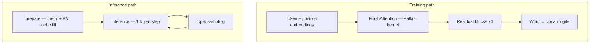
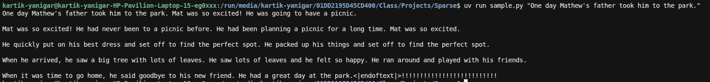

# JAX Flash miniGPT

TinyGPT language model pretraining on **TinyStories** with a custom **Flash Attention** kernel written in **JAX Pallas**, **Flax NNX**, and **SPMD sharding** (1 / 2 / 8 devices). Includes KV-cache autoregressive decoding.

> Engineering prototype demonstrating custom kernel development, distributed training, and train/serve debugging — not a production LLM stack.

## Results


| Metric             | This project                       | [JAX miniGPT tutorial](https://github.com/jax-ml/jax-ai-stack/blob/main/docs/source/JAX_for_LLM_pretraining.ipynb) |
| ------------------ | ---------------------------------- | ------------------------------------------------------------------------------------------------------------------ |
| Cross-entropy loss | ~**1.2**                           | ~1.4                                                                                                               |
| Transformer layers | 4                                  | 4                                                                                                                  |
| Embed dim / heads  | 256 / 8                            | 256 / 8                                                                                                            |
| Attention          | Custom Pallas Flash + `custom_vjp` | `nnx.MultiHeadAttention`                                                                                           |
| Hardware           | Kaggle GPU T4x2                   | TPU                                                                                                                |

### Training curves


## Architecture




**Training:** full-sequence causal flash attention via `jax.custom_vjp`.  
**Inference:** separate KV-cache path with JIT-safe score masking and absolute position offsets.

## Key contributions

- **Pallas Flash Attention** — tiled forward/backward kernels with online softmax and causal masking
- `jax.custom_vjp` — custom backward wired into Flax NNX training
- **SPMD sharding** — adaptive `Mesh` for `len(devices) ∈ {1, 2, 8}` + `shard_map` + partitioned NNX weights
- **KV-cache decoding** — `prepare` / `inference` with corrected cache axes, position embeddings, and attention masks


## Quick start

### Install with uv

`uv` does **not** auto-detect GPU/CUDA for JAX — pick an extra explicitly. Base deps use CPU `jax`; GPU needs the `cuda` extra.

```bash
# CPU (default jaxlib)
uv sync --extra cpu --extra dev

# NVIDIA GPU (CUDA 12 wheels from PyPI)
uv sync --extra cuda --extra dev

# System CUDA already installed (skip bundled nvidia-* wheels)
# uv add "jax[cuda12-local]"   # or cuda13-local — then uv sync
```

`cpu` and `cuda` conflict in `[tool.uv]`; sync with only one. Verify:

```bash
uv run python -c "import jax; print(jax.devices())"
```

### Kaggle (GPU T4×2 or TPU v5e-8)

The training notebook adapts the mesh from `jax.devices()`:

| `len(devices)` | Mesh shape | Typical Kaggle accelerator   |
| -------------- | ---------- | ---------------------------- |
| 1              | `(1, 1)`   | single GPU / CPU             |
| 2              | `(2, 1)`   | **GPU T4×2** (reported run)  |
| 8              | `(4, 2)`   | **TPU v5e-8**                |

1. Open `[notebooks/train_tinystories.ipynb](notebooks/train_tinystories.ipynb)` on Kaggle
2. Set accelerator to **GPU T4×2** or **TPU v5e-8**
3. Attach a TinyStories dataset (or use the CSV split referenced in the notebook)
4. Run all cells — install the matching JAX backend in the first cell:

```bash
# Shared deps
pip install -q wandb protobuf tiktoken grain ml_collections orbax-checkpoint einops flax optax

# GPU T4×2
pip install --upgrade -q "jax[cuda12]"

# TPU v5e-8
pip install --upgrade -q "jax[tpu]" -f https://storage.googleapis.com/jax-releases/libtpu_releases.html
```

### Local development (CPU, 8 simulated devices)

```bash
uv sync --extra cpu --extra dev
export XLA_FLAGS=--xla_force_host_platform_device_count=8
uv run pytest -q
jupyter notebook notebooks/train_tinystories.ipynb
```

Pallas kernels run with `interpret=True` for correctness debugging on CPU.

Checkpoints expect a matching device count when restored (1, 2, or 8). For an 8-way TPU checkpoint on local CPU, set `XLA_FLAGS` as above; for a T4×2 checkpoint use `--xla_force_host_platform_device_count=2`.

### Sample from a checkpoint

```bash
uv sync --extra cpu   # or --extra cuda
uv run sample.py "There was a small home..." --checkpoint checkpoints/YOUR_RUN_state
# or set FLASH_GPT_CHECKPOINT=checkpoints/YOUR_RUN_state and omit --checkpoint
```

Optional flags: `--seed`, `--temperature`, `--top-k`, `--max-new-tokens`.



### Weights & Biases (optional)

```python
import wandb
wandb.login()  # uses WANDB_API_KEY env var — never commit keys
run = wandb.init(project="jax-flash-minigpt", config=config.to_dict())
```


## Project structure

```
├── README.md
├── LICENSE
├── pyproject.toml
├── requirements.txt
├── src/flash_gpt/                  # extracted library (config, attention, model, train, sample)
├── tests/                          # flash forward/backward + inference cache tests
├── notebooks/
│   └── train_tinystories.ipynb     # training + sampling (Kaggle T4×2 / TPU v5e-8; 1/2/8 devices)
├── docs/
│   ├── architecture.md
│   ├── portfolio-repo-plan.md
│   └── ...                         # debugging & kernel analysis
├── assets/                         # W&B loss curves + CLI sampling screenshot
│   ├── train_loss.svg
│   ├── val_loss.svg
│   └── sample_cli.png
└── JAX_for_LLM_pretraining.ipynb   # external baseline (jax-ai-stack), not authored here
```


### Package layout (`flash_gpt`)


| Module           | Role                                                |
| ---------------- | --------------------------------------------------- |
| `config.py`      | Hyperparameters (`get_config`)                      |
| `runtime.py`     | Mesh + global init (`init_from_config`)             |
| `attention/`     | Pallas kernels, `flash_attention`, `FlashAttention` |
| `model/`         | `TinyGPT`, embeddings, residual blocks              |
| `data.py`        | Grain pipeline (`build_datasets`)                   |
| `train.py`       | Loss, optimizer, sharded training loop              |
| `sample.py`      | KV-cache autoregressive sampling                    |
| `checkpoints.py` | Orbax save/load helpers                             |


## Acknowledgments

- [JAX for LLM pretraining](https://github.com/jax-ml/jax-ai-stack) — baseline miniGPT tutorial
- [FlashAttention](https://arxiv.org/abs/2205.14135) — algorithm reference
- [TinyStories](https://huggingface.co/datasets/roneneldan/TinyStories) — dataset

## License

MIT — see [LICENSE](LICENSE).